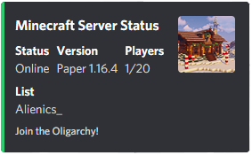

<h1 align="center">Steve.</h1>
<h3 align="center">A Minecraft Server Status Panel</h3>

    
    
       

---

Steve is a Discord bot that tracks your Minecraft servers.  Built in the Node.js environment and the [discord.js](https://discord.js.org/#/) library, Steve aims to provide an easily accessible and well displayed status panel for your server.

## Invite
Invite Steve to your Discord server [here](https://discord.com/api/oauth2/authorize?client_id=773117222380896276&permissions=18432&scope=bot).  Run `-mc setup` and follow the setup instructions.

### Enable server querying
##### Vanilla Servers
- In your `server.properties file`, set `enable-query` to `true`.
- In `server.properties`, ensure `query.port` is the same as `server.port`.
- Ensure the query port is port forwarded if not using server port.
- Save and restart the server.
##### Bungeecord Servers
- In `config.yml`, set `query_enabled` to true.
- In `config.yml`, ensure `query_port` is the same as server port (`host` port)
- Ensure the query port is port forwarded if not using server port.
- Save and restart the proxy.
##### Unable to use Query
If you cannot enable query on your server, run `-mc setup query <enable|disable` to enable or disable querying. When query is disabled, Steve will instead use server pinging. Note that this may break some functionality (Player list will not be shown on Bungeecord servers).

### Use the Setup commands
`-mc setup ip <SERVER IP>` | Set the server IP (URL also accepted)

`-mc setup port <SERVER PORT>` | Set the server port (Default 25565)

`-mc setup name <SERVER NAME>` | Give your server a name

`-mc setup footer <FOOTER MESSAGE>` | Set a footer message for your status panel

### Finish
Setup is complete!  Run `-mc status` to display the server status panel.  More commands can be found [here](/docs/usage/commands.md) or by typing `-mc help` in your Discord server.

## Self Host
If you would like to host the bot yourself, instructions on how to do so can be found [here](docs/setup/getting_started.md).

Direct Links:
* [Getting Started](docs/setup/getting_started.md)
* [Database Setup](docs/setup/db_setup.md)
* [Additional Configuration](docs/setup/additional_configuration.md)
