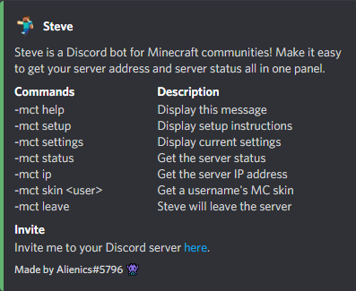
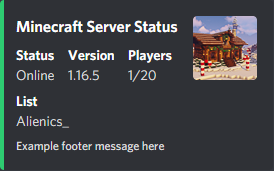
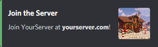
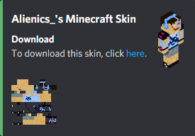
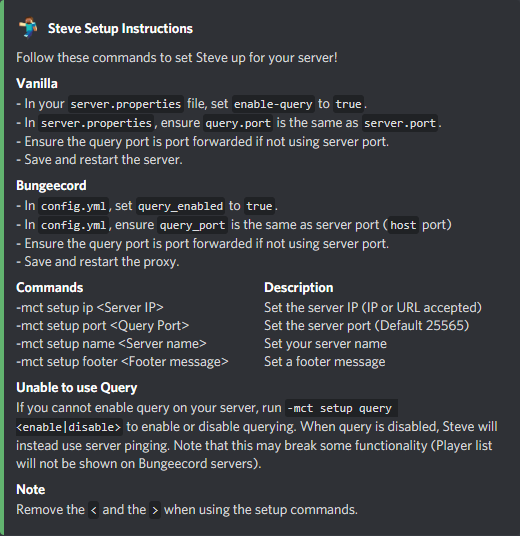
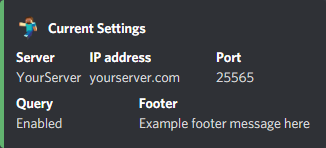
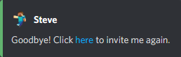

# Commands
Below are all the commands that can be executed by the bot.

## General Commands
Commands that can be executed by anybody in the server.
### Help

Displays all the commands available.

### Status
Displays the status of your Minecraft server.

### IP / Join
Display the IP Address/URL of the Minecraft server.

### Skin
Specify a Minecraft player name (Eg. `-mc skin Alienics_`) to display their Minecraft skin.

## Administrator Only Commands
Only Discord users with the administrator permission can execute these commands.
### Setup

If used without arguments (`-mc setup`), Steve will display setup instructions.  Using any of the following arguments will change the settings.

##### Available arguments
* `ip` - Set the IP address or URL of your Minecraft server.  Eg. `-mc setup ip yourserver.com`
* `port` - Set the port of your server if not default (25565).  Eg. `-mc setup port 25565`
* `query` - Enable or disable server querying. (Default enabled).  Eg. `-mc setup query enable`
* `name` - Set the name of your Minecraft server.  Eg. `-mc setup name Your Server`
* `footer` - Set a short message to be displayed every time the `status` command is called. Eg. `-mc setup footer Come play with us!`

### Settings
Displays your current setup without changing settings.

### Leave
Steve will leave your server.
